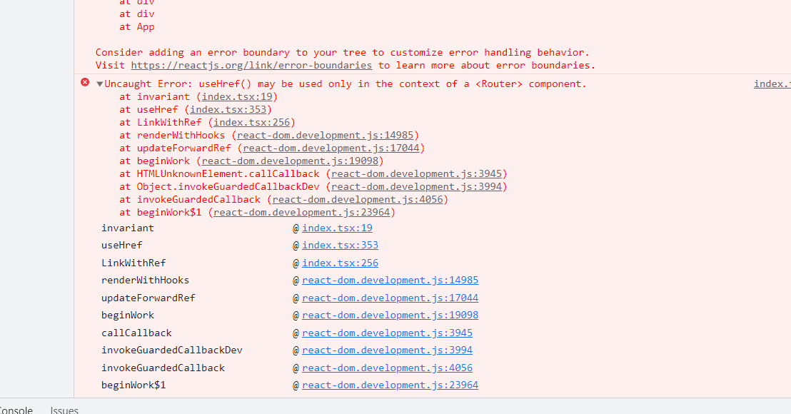

### 错误处理
* react-router-dom

原因在于react-router-dom里面的browserrouter没有包裹住link,处理办法是在app.js入口处包裹

### redux react-redux redux-toolkit
* 1. 用于构建serveice的redux配置 `services/cryptoApi.js`:
```
import { createApi, fetchBaseQuery } from '@reduxjs/toolkit/query/react'
const cryptoApiHeaders = {
    'x-rapidapi-host': 'coinranking1.p.rapidapi.com',
    'x-rapidapi-key': 'd2508390f9msh0e490d0d11c0890p1eed39jsnff556cb14cd9'   
}

const baseUrl = 'https://coinranking1.p.rapidapi.com';

const createRequest = (url) => ({
    url,
    headers: cryptoApiHeaders
})

// 配合的url请求
export const cryptoApi = createApi({
    reducerPath: 'cryptoApi',
    baseQuery: fetchBaseQuery({ baseUrl }),
    endpoints: (build) => ({
        getCryptos: build.query({
            query: () => createRequest('/coins')
        })
    })
})


export const {
    useGetCryptosQuery
} = cryptoApi;

```

* 2. 配置的store,用于在子组件下引用: `store.js`
```
import { configureStore } from '@reduxjs/toolkit';

import { cryptoApi } from '../services/cryptoApi';

export default configureStore({
    reducer: {
        [cryptoApi.reducerPath]: cryptoApi.reducer
    }
})
```

* 3. 子组件的使用案例:
```
import React from 'react';
import { Typography, Row, Col, Statistic } from 'antd';
import { Link } from 'react-router-dom';
import millify from 'millify';

import { useGetCryptosQuery } from '../services/cryptoApi';

const { Title } = Typography;

const Homepage = () => {
    const { data, isFetching } = useGetCryptosQuery();
    const globalStats = data?.data?.stats;

    if(isFetching) return 'Loading...'
    
    return (
        <>
            <Title level={2} className='heading'>
                global crypto state
            </Title>
            <Row>
                <Col span={12}><Statistic title='Total Cryptocurrencies' value={globalStats?.total}></Statistic></Col>
                <Col span={12}><Statistic title='Total Exchanges' value={millify(globalStats?.totalExchanges)}></Statistic></Col>
                <Col span={12}><Statistic title='Total Market Cap' value={millify(globalStats?.totalMarketCap)}></Statistic></Col>
                <Col span={12}><Statistic title='Total 24h Volume' value={millify(globalStats?.total24hVolume)}></Statistic></Col>
                <Col span={12}><Statistic title='Total Markets' value={millify(globalStats?.totalMarkets)}></Statistic></Col>
            </Row>
        </>
    )
}

export default Homepage

```